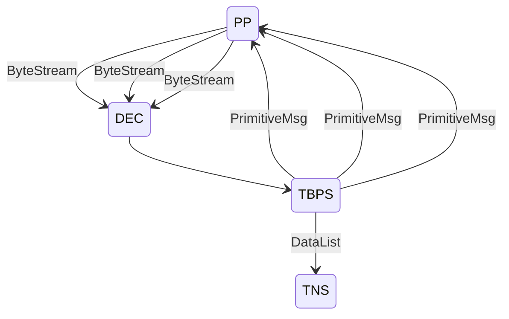
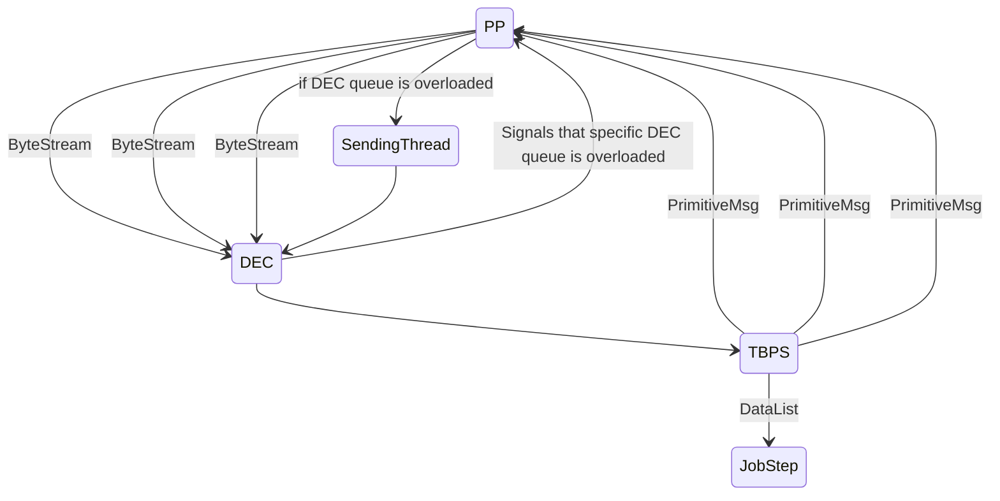

Let's begin from 1/3 of a journey, name when TupleBPS starts sending PrimitiveTasks towards PrimProc process - worker. The task usually causes BPP to process a series of records called RowGroup. BPP::execute() has a method called sendResponse() that serializes RowGroup buffer class - RGData into transmitable ByteStream. This ByteStream is to be sent back to ExeMgr facility(coordinator) via either network or a function call(if PP and EM belongs to the same process). The ByteStream goes into DistributedEngineCommunication queue(via either TCP socket reading thread or function call from the prev stage puts it into the DEC queue) that belongs to that particular uniqueID(subquery, small side of a JOIN, a query). TBPS at this point has a reading thread that runs the main loop of TBPS::receiveMultiPrimitiveMessage. TBPS reads a bunch of ByteStreams from the queue with the uniqueID, turns them into RGData buffers and then either puts it into DataList(another queue) that is used b/w JobSteps or preprocesses RGDatas and puts it into DL. After EM query execution pipeline is done the coordinator sends the results to the plugin, or in case of a syscat query whatever facility asks for the results. 
The bottlenecks and limitations becomes obvious when there is a load or computation resources are scarce, e.g. in containers(see [MCOL-5489](https://jira.mariadb.org/browse/MCOL-5489))
- DEC queues are unlimited that hides the fact that TBPS can't handle the workload. This fact also increases the latency and consumes RAM to store ByteStreams that TBPSn JobSteps or MDB can't handle in time b/c there are multiple producer threads in PP and single consumer;
- This behavior was uncovered with the patch that forces PP worker to put a Bytestream directly into DEC via method call. Previously PP sends ByteStream over a local loopback.
- There is a flow control mechanism that forces PP to collect ByteStreams locally, this flow control also asks for a confirmation for every PrimitiveMsg. This mechanism proves itself ineffective b/c it is basically the same, namely it has an unlimited queue;
- DataList queues are limited so DLs back propagate a processing congestion


There is a mechanism called Control Flow that does it best to prevent ExeMgr facility overload. There are number of parameters that modify Control Flow behavior. Here are all of them with their defaults.
```xml
<ControlFlow>
	<BPPSendThreadBytesThresh>250000000</BPPSendThreadBytesThresh>
	<BPPSendThreadMsgThresh>100</BPPSendThreadMsgThresh>
	<DECFlowControlEnableBytesThresh>50000000</DECFlowControlEnableBytesThresh>
	<DECFlowControlDisableBytesThresh>10000000</DECFlowControlDisableBytesThresh>
</ControlFlow
```

The previous schema had an addition, namely a SendingThread b/w PP and DEC that has a limited ByteStream queue. If a certain DEC queue byte size gets over DECFlowControlEnableBytesThresh DEC signals to PP to send ByteStreams via SendingThread queue only. If DEC queue size in bytes becomes smaller than DECFlowControlDisableBytesThreshs DEC signals PP to stop using SendingThread. If (SendingThread queue size in bytes > BPPSendThreadBytesThresh and queue size > 3)  or (SendingThread queue size >  BPPSendThreadMsgThresh) PP begins to reschedule(effectively fail before PP starts doing them) PrimitiveMsgs it gets from TBPS[1].



There is an unlimited queue in DEC and IMHO it is hard to put a limit there so the suggested approach is:
- Move control flow into TBPS
- There will be a cummulative (bytes size + queue depth) metric.
- The metric affects the number of maximum concurrent outstanding PrimitiveMsges, namely the bigger the metric value is the smaller the number of outstanding PrimitiveMsges

1. Not ideal at all b/c there might be multiple ExeMgrs in a cluster, some of them might be overloaded but SendThread is shared for all of them.