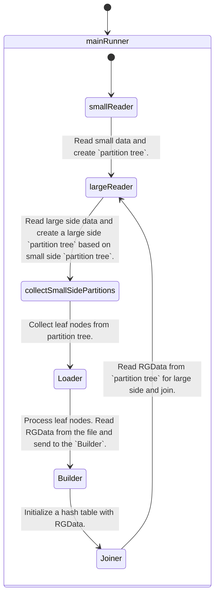

`DiskJoinStep(DJS).`

`DiskJoinStep` is designed to handle large joins, which are exceeded the memory limit.
CS uses "hash join" to implement a join.

`HashJoin` - (small side table, large side table).
Initialize hash table with small side, join large side row by row on a hash table, append result into result data list (FIFO).

`Disk based hash join` - (small side table, large side table).
Based on small side data create a "partition tree".
Based on large side data use existing "partition tree" (without spliting) to store large side data.
`Partition tree` - is a tree where each node holds a pointers to other nodes, except leaf nodes, they hold pointers to the file with data.
Each leaf node holds data which gives the same hash, therefore we can join small side on large side only from the same leaf nodes.
Partition tree can be splitted when the leaf node exceeded the memory limit for the small side.
`Split leaf node` - make leaf node a regular node, redistribute the data in this node into new created nodes based on hash.

