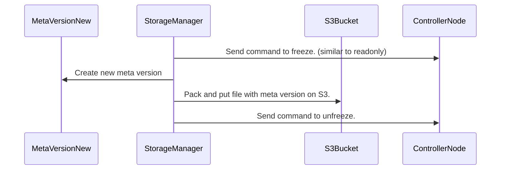
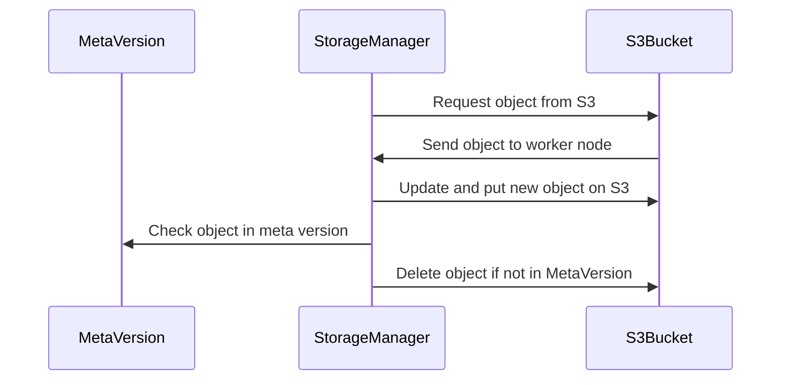
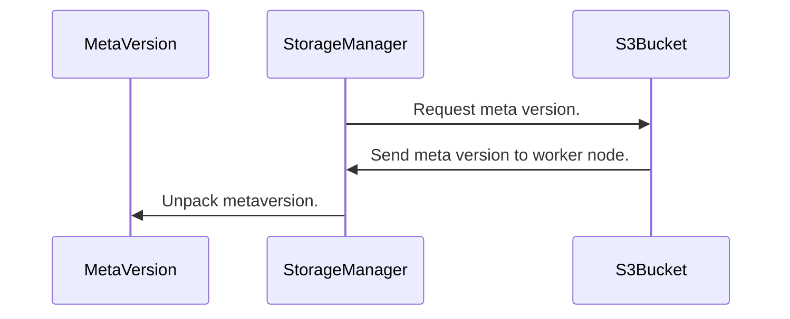

`Create meta version.`

```mermaid
sequenceDiagram
    participant MetaVersionNew
    participant StorageManager
    participant S3Bucket
    participant ControllerNode
    StorageManager->>ControllerNode: Send command to freeze. (similar to readonly)
    StorageManager->>MetaVersionNew: Create new meta version
    StorageManager->>S3Bucket: Pack and put file with meta version on S3.
    StorageManager->>ControllerNode: Send command to unfreeze.
```

`Regular work flow.`

```mermaid
sequenceDiagram
    participant MetaVersion
    participant StorageManager
    participant S3Bucket
    StorageManager->>S3Bucket: Request object from S3
    S3Bucket->>StorageManager: Send object to worker node
    StorageManager->>S3Bucket: Update and put new object on S3
    StorageManager->>MetaVersion: Check object in meta version
    StorageManager->>S3Bucket: Delete object if not in MetaVersion
```

`On rollback to version.`

```mermaid
sequenceDiagram
    participant MetaVersion
    participant StorageManager
    participant S3Bucket
    StorageManager->>S3Bucket: Request meta version.
    S3Bucket->>StorageManager: Send meta version to worker node.
    StorageManager->>MetaVersion: Unpack metaversion.
```
