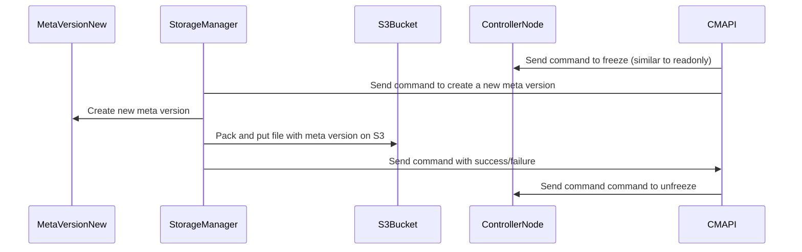
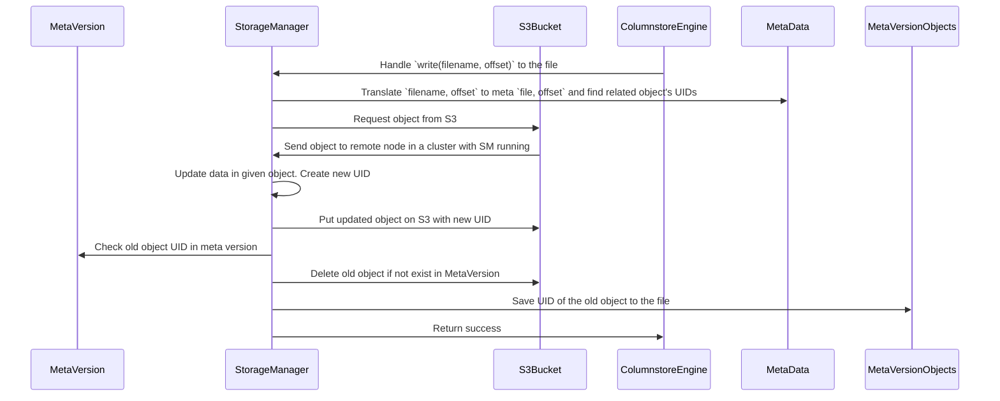
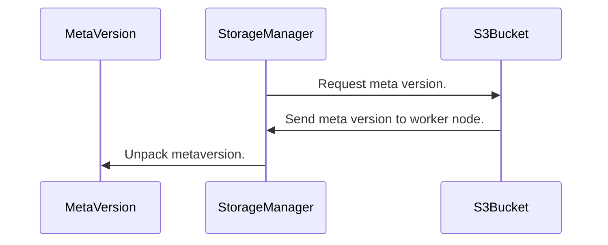
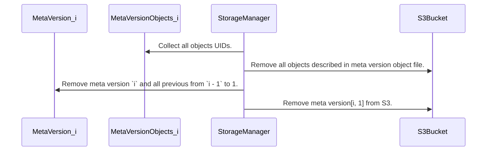

Storage manager `Meta versioning` - is approach to startup any node from any available version.
CS uses StorageManager to communicate(send/receive data) with a S3 bucket.
StorageManager designed as a plugin which intercepts `write`, `open`, `read`, `append` etc. functions
and applies its own logic.
StroageManager locally has only 3 types of files - `journal`, `meta`, `cache`.
`Journal files` - files to be stored into S3 bucket by background `Synchronizer` thread.
`Meta files` - files which map CS .cdf files(data files) to S3 object files.
`Cache` - files which a cached locally.

`Create meta version.`

At certain intervals:
1. CMAPI sends command to ControllerNode to freeze any operation.
2. CMAPI sends command to create a meta version for each SM in cluster.
3. SM takes current one store it locally with name `metaversion_i`.
4. SM compresses and put on S3.
5. CMAPI sends command to Controller node to unfreeze.

`DML command`
1. SM intercepts `DML command`.
2. Checks `object` locally and on S3.
3. Updates `given` object or create new one.
4. Puts object on S3.
5. Checks old objects UID in previous meta versions, if object exists put UID into local file otherwise delete it from S3.

`On startup with meta version.`
1. Downloads meta version from S3 and unpacks it.

`Remove meta version.`
1. Collects all objects UID related to a meta version i.(They all placed in the file)
2. Removes all objects from S3 bucket
3. Removes meta version i and all from i - 1 to 1 locally and from S3 bucket.

