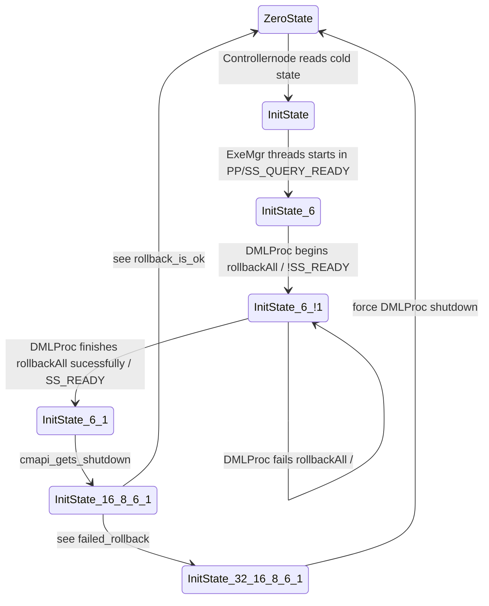

- SessionManagerServer has a number of state flags:
	- SS_READY = 1; // Set by dmlProc one time when dmlProc is ready
	- SS_SUSPENDED = 2// Set by console when the system has been suspended by user.
	- SS_SUSPEND_PENDING  = 4// Set by console when user wants to suspend, but writing is occuring.
	- SS_SHUTDOWN_PENDING = 8 // Set by console when user wants to shutdown, but writing is occuring.
	- SS_ROLLBACK = 16; // In combination with a PENDING flag, force a rollback as soon as possible.
	- SS_FORCE = 32; // In combination with a PENDING flag, force a shutdown without rollback.
	- SS_QUERY_READY = 64 // Set by PrimProc after ExeMgr thread is up and running

- The actual state is a combination of flags.

- The state of a running cluster resides in SessionManagerServer instance attribute that is inside a controllernode process.

- There is a cold storage for a state that is stored in a file pointed by SessionManager.TxnIDFile with /var/lib/columnstore/data1/systemFiles/dbrm/SMTxnID. This cold state is loaded up when controllernode starts.

- The following FSM diagram demostrates some transitions. !It is not full yet!

cmapi_gets_shutdown: CMAPI gets shutdown request with TO / SS_SHUTDOWN_PENDING + SS_ROLLBACK
rollback_is_ok: DMLProc sucessfully rollbacks active txns within TO and cluster stops
failed_rollback: DMLProc sucessfully rollbacks active txns within TO and cluster stops
